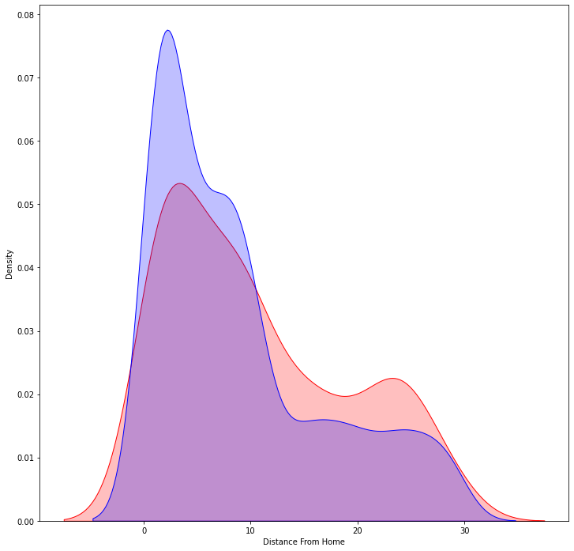
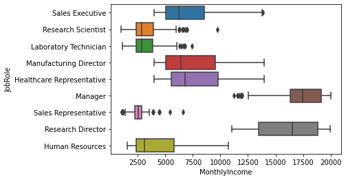
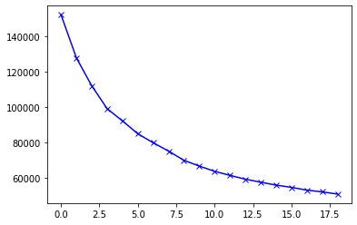
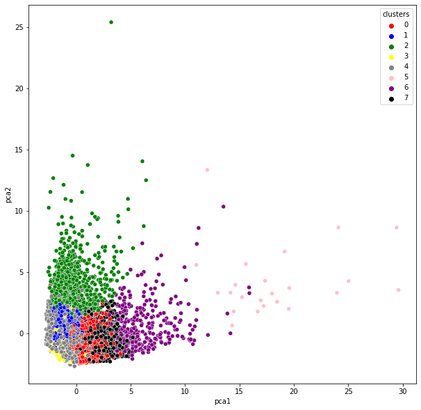
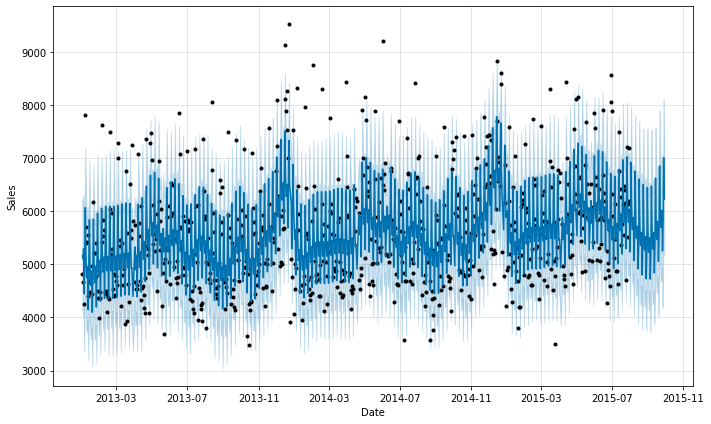
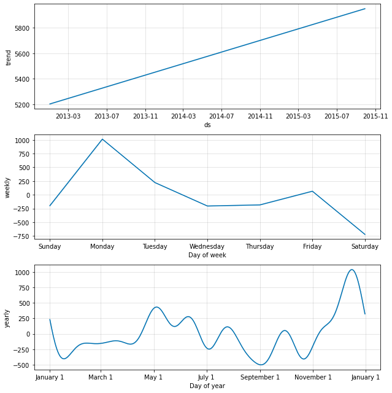
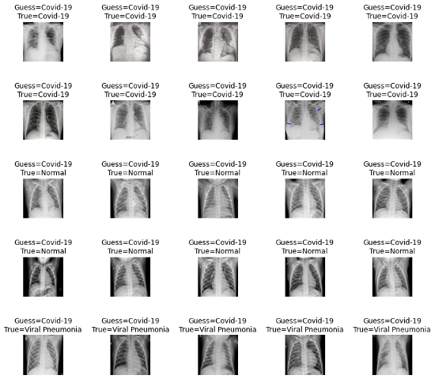
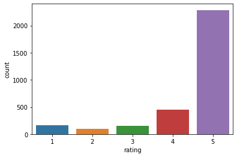
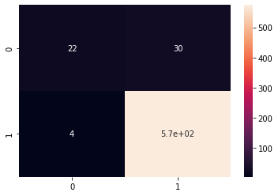
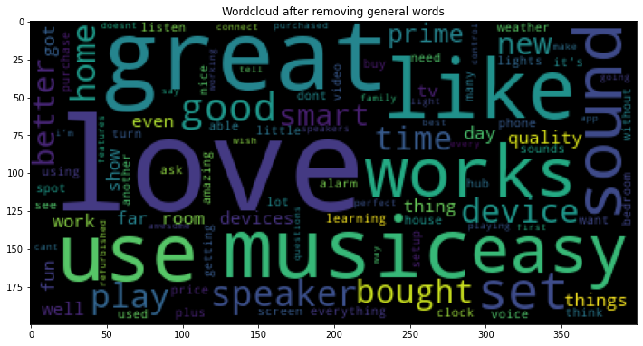

Hi my name is Aeshna,I am a data scientist with about 2 years of experience in building data-intensive applications aiming for better customer
insights. I have extensive experience in Python, data visualization, pattern recognition as well as quantitative market
research. I have strong communication skills and experience in explaining technical topics to a general audience. I am dedicated to continuously learning and enhancing my skills. 
Below are some of the data science for Business project I made. 
You can reach out to me via: [LinkedIn](https://www.linkedin.com/in/aeshna-gupta-6b37b4165/)

**Content**:
1. [Project 1: Human Resource Use case](# Project 1: Human Resource Use Case)
2. [Project 2: Marketing Use case](# Project 2: Marketing Use Case)
3. Project 3: Sales Use case
4. Project 4: Healthcare Use case
5. Project 5: Public Relations Use case 

# Project 1: Human Resource Use Case
## [Employees Attrition Predictive Modeling](https://github.com/aeshna25/Employees-Attrition-Predictive-Modeling-)
- Created a predictive model using **ANN, Logistic Regression and Random forest**
- Aim is to help organization understand the reasons behind employees who are leaving the company
- The dataset has more the 1400+ employees records across 35 different features
- Compared 3 different models to understand which predictive model gives the best accuracy, for this dataset Logistic regression passed with the best performance.

# Project 2: Marketing Use Case  
## [Customer Segmentation using KMeans and PCA](https://github.com/aeshna25/Customer-Segmentation-using-KMeans-and-PCA)
- Marketing is essential for brands to attract customers. One of the dwelling pain points of companies is to segment customers in a way so that marketers can lauch campagines targeting to particular segments
- Using machine learning **clustering models like Kmeans and dimensionality reduction processes like PCA, with this project segmented bank customers into 4 types**.
    1. First Customers cluster (Transactors): Those are customers who pay least amount of intrerest charges and careful with their money, Cluster with lowest balance ($104) and cash advance ($303), Percentage of full payment = 23%
    2. Second customers cluster (revolvers) who use credit card as a loan (most lucrative sector): highest balance ($5000) and cash advance (~$5000), low purchase frequency, high cash advance frequency (0.5), high cash advance transactions (16) and low percentage of full payment (3%)
    3. Third customer cluster (VIP/Prime): high credit limit $16K and highest percentage of full payment, target for increase credit limit and increase spending habits
    4. Fourth customer cluster (low tenure): these are customers with low tenure (7 years), low balance 
- EDA helped in observing the trends and certain correlations between customer features.
- Also tested **Auto encoder for dimentionality reductions** and compared the results to that of PCA

# Project 3: Sales Use Case
## [Future Daily Sales Prediction of Stores](https://github.com/aeshna25/Future-Daily-Sales-)
- Predictive model to forecast future sales using historical data, while taking into account seasonality changes, holidays, promotion for 1000+ stores.
- For this project, the objective is to understand the dependency of store sales on multiple factors like competition, competion distance , type of holidays, customer footfall, day of the week, month,type of store.
- The details of of the features/columns can be found [here](https://github.com/aeshna25/Future-Daily-Sales-/tree/main/Dataset)
- For Predictive modeling,we have used **Facebook Prophet**. It is an open source software by Facebook. The main aim of the software is to work with time-series data. The predictive can be also give trends like weekly and daily seasonality and also holiday effects. The main model working behind Facebook Prophet is Regression.
- The main USP of Facebook Prophet is its capabitlity to work with missing with outliers.

The below graphs shows the 60 days ahead prediction for a particular store, and in addition to it the yearly, monthly and weekly trend of the store as well. 

# Project 4: Healthcare Use Case
## [Detecting and Classifying Chest Disease](https://github.com/aeshna25/Detecting-and-Classifying-Chest-Disease)
- Developed a model that can detect and classify 4 different chest disease from X-Ray images. 
- The training dataset has 133 images for each type of Chest Disease.
The Chest Dignosis we are dealing with in the projects are
    1. Covid19
    2. Bacterial Pneumonia X-ray
    3. Viral Pneumonia X-ray
    4. Normal Xray
- For the prediction, I applied **CNN**, where the first layers are used to extract high level general features and the last few layers are used to perform Classification. To overcome the vanishing gradient problem, ResNET(ImageNET training) was used for its **Skip connection** features.
- Finally to improve the model's performance, I used **Transfer Training**, in which a network that has been trained to perform a specific task gets  reused as a starting point for another similar task.

The model was trained using 
- activation functions like : relu and softmax
- Generalization steps: Dropout layers
- Checking overfiiting: Early stopping after 20 epochs

# Project 5: Public Relations Use Case
## [Predicting-Customer-satisfaction-using-customer-reviews](https://github.com/aeshna25/Predicting-Customer-satisfaction-using-customer-reviews)
- Predicting whether customers are satisfied with the product based on their reviews and rating.
- For this project the object is to understand customers through there reviews on Amazon's famous voice assistant product-- Alexa. 
- The dataset has more than 3000 reviews from actual customers having information like review, date, rating, alexa model and feedback.
- The target feature is the feedback, which is a binary column where 1 means positive and 0 means negative. The project focuses on using **Natural language processing** capabilities to convert words into numbers and use them furture to create predictive models.
- Python's **nltk library** is a powerful tool which has capabilities such as removing stopwords,punctuations, lemmatization etc. It also gives an option to customize the stopwords list according to the dataset.
- Before feeding the word document to the model, it was converted into numerical format. The categorical column was converted using **Dummy variable** and the word document was **tokenized using count vectorizer technique.**
- The newly prepared numerical dataset is than used for prediction the train test split is done is the ration 4:1, and is fed to **Naive Bayes classfier** which is great for multi-class problems and **Logistic regression**. Both the models were judged on the **performance matrix: Accuracy** and the results shows that on one hand where Naive bayes classfier gave a good accuracy of 94% , Logistic Regression stood victorious with close to perfect accuracy score.

